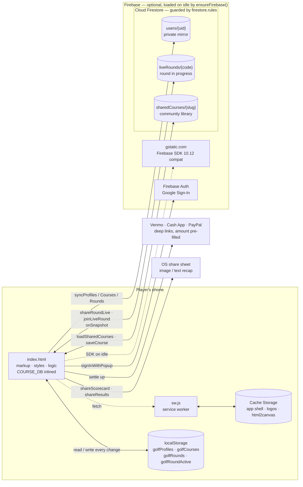
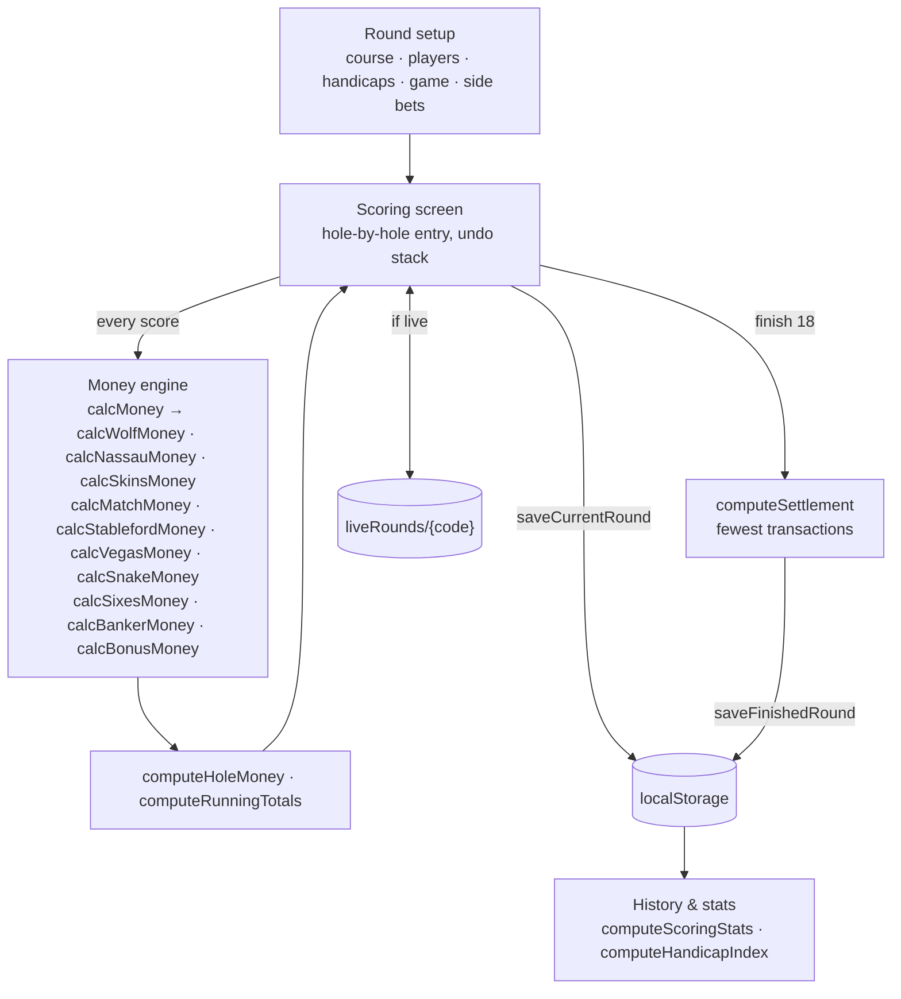
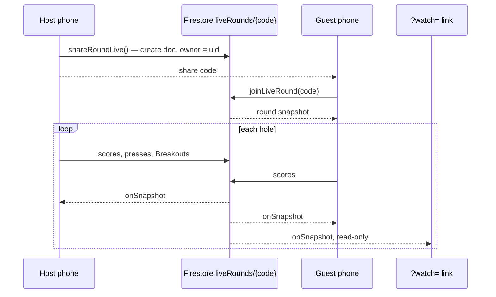
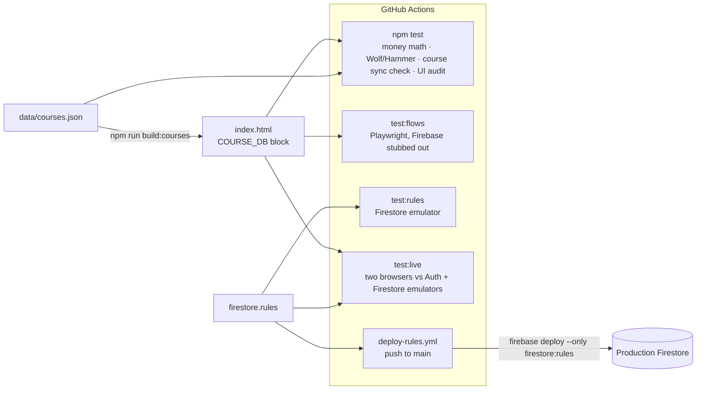

# Architecture

The Press is a single-file, offline-first PWA. The phone is the source of truth;
Firebase is an optional mirror that adds sync, live rounds, and a shared course
library. The diagrams below render on GitHub.

## System overview

Key properties:

- **Nothing on the launch path touches the network.** The SDK is fetched after
  the first screen is up, so the scorecard opens in a dead zone.
- **Firestore mirrors, never owns.** A signed-out player loses nothing;
  `syncFromFirestore()` merges the cloud copy back into `localStorage`.
- **Money never moves through the app.** Settlement hands off to payment apps.

## Inside `index.html`

## Live rounds

The six-character share code *is* the document ID, so a round can be fetched by
its code but the collection can't be listed.

## Build, test, and deploy

`scripts/build-preview.py` produces the two builds the browser tests drive by
rewriting the `FIREBASE_SDK` array: emptied for `flows.mjs`, repointed at
`node_modules` for `live-round.test.mjs`.
